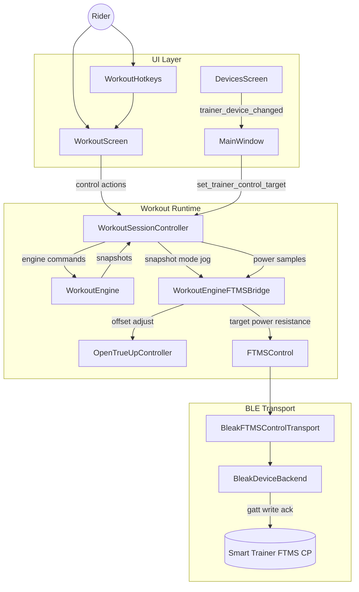
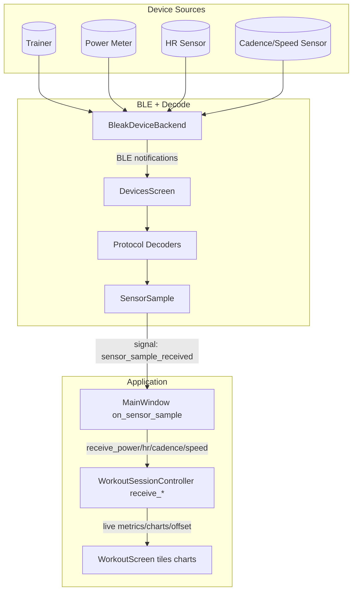
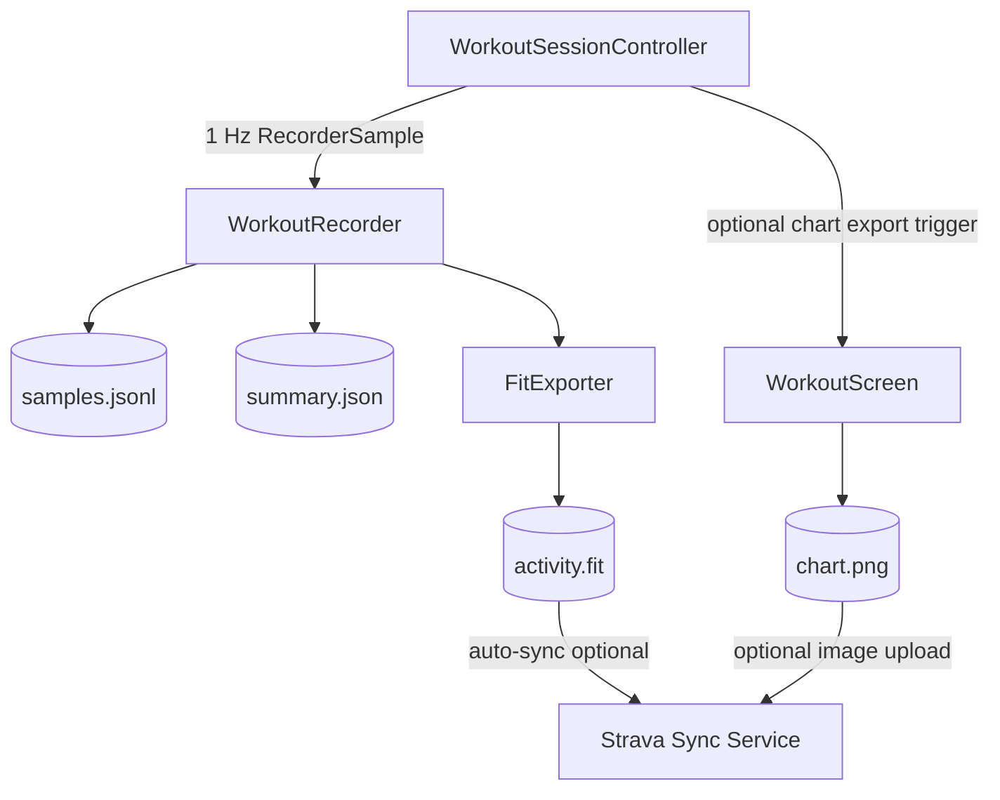

# OpenCycleTrainer Architecture Diagram

This diagram documents how control commands and live data currently route through the project modules.

## Control Command Routing (UI -> Trainer)

## Telemetry Routing (Devices -> UI)

## Recording/Export Routing (Controller -> Storage/Cloud)

### Diagram Node Key

- `WorkoutHotkeys`: `opencycletrainer/ui/hotkeys.py`
- `WorkoutScreen`: `opencycletrainer/ui/workout_screen.py`
- `DevicesScreen`: `opencycletrainer/ui/devices_screen.py`
- `MainWindow`: `opencycletrainer/ui/main_window.py`
- `WorkoutSessionController`: `opencycletrainer/ui/workout_controller.py`
- `WorkoutEngine`: `opencycletrainer/core/workout_engine.py`
- `WorkoutEngineFTMSBridge`, `FTMSControl`: `opencycletrainer/core/control/ftms_control.py`
- `OpenTrueUpController`: `opencycletrainer/core/control/opentrueup.py`
- `BleakDeviceBackend`, `BleakFTMSControlTransport`: `opencycletrainer/devices/ble_backend.py`
- `Protocol Decoders`: `opencycletrainer/devices/decoders/*`
- `SensorSample`: `opencycletrainer/core/sensors.py`
- `WorkoutRecorder`: `opencycletrainer/core/recorder.py`
- `FitExporter`: `opencycletrainer/core/fit_exporter.py`
- `Strava Sync Service`: `opencycletrainer/integrations/strava/sync_service.py`

## Notes

- `WorkoutSessionController` is the central integration point between UI commands, engine snapshots, trainer control, and recording.
- Cadence source selection in the controller uses priority: dedicated cadence sensor > power meter > trainer.
- OpenTrueUp receives both trainer and bike power samples, computes an offset, and can trigger ERG target re-application.
- Current implementation gap: resistance jog updates internal/UI resistance state, but does not yet send a resistance command to the trainer (marked TODO in `ui/workout_controller.py`).
