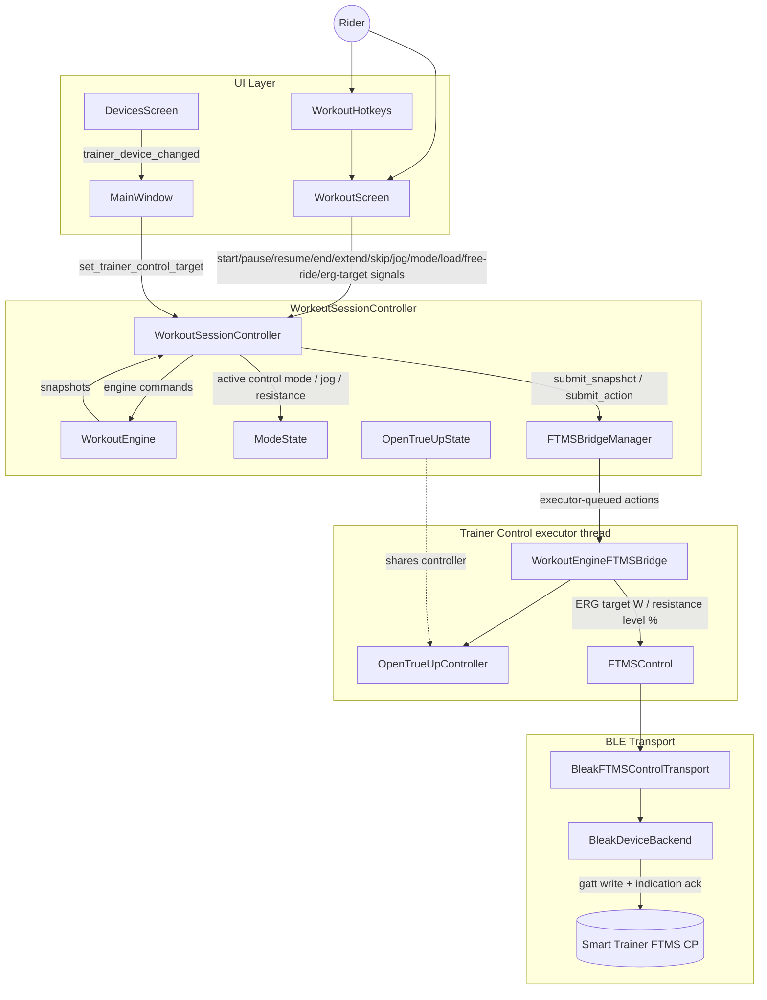
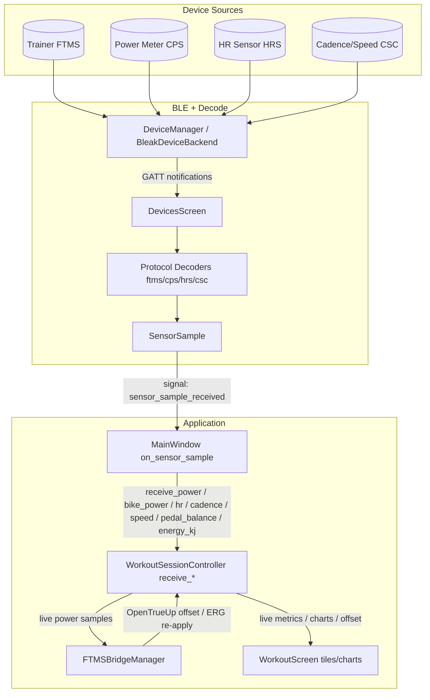
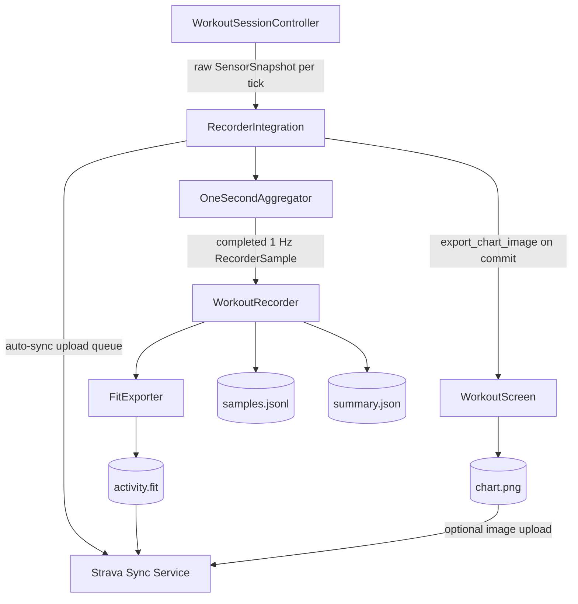
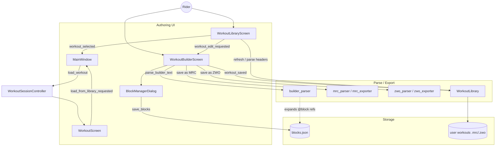

# OpenCycleTrainer Architecture Diagram

This diagram documents how control commands, live telemetry, recording, and workout
authoring route through the project modules.

## Control Command Routing (UI -> Trainer)

## Telemetry Routing (Devices -> UI)

## Recording/Export Routing (Controller -> Storage/Cloud)

## Workout Authoring Routing (Library / Builder / Blocks)

### Diagram Node Key

- `WorkoutHotkeys`: `opencycletrainer/ui/hotkeys.py`
- `WorkoutScreen`: `opencycletrainer/ui/workout_screen.py`
- `DevicesScreen`: `opencycletrainer/ui/devices_screen.py`
- `SettingsScreen`: `opencycletrainer/ui/settings_screen.py`
- `MainWindow`: `opencycletrainer/ui/main_window.py`
- `WorkoutSessionController`: `opencycletrainer/ui/workout_controller.py`
- `ModeState`: `opencycletrainer/ui/mode_state.py`
- `OpenTrueUpState`: `opencycletrainer/ui/opentrueup_state.py`
- `FTMSBridgeManager`: `opencycletrainer/ui/ftms_bridge_manager.py`
- `RecorderIntegration`, `SensorSnapshot`: `opencycletrainer/ui/recorder_integration.py`
- `WorkoutEngine`, `WorkoutEngineSnapshot`: `opencycletrainer/core/workout_engine.py`
- `WorkoutEngineFTMSBridge`, `FTMSControl`: `opencycletrainer/core/control/ftms_control.py`
- `OpenTrueUpController`: `opencycletrainer/core/control/opentrueup.py`
- `HybridModeController`: `opencycletrainer/core/control/hybrid_mode.py` (implemented + tested, not yet wired into the live UI)
- `OneSecondAggregator`: `opencycletrainer/core/one_second_aggregator.py`
- `DeviceManager`: `opencycletrainer/devices/device_manager.py` (abstract; `BleakDeviceBackend`, `MockBackend` implement it)
- `BleakDeviceBackend`, `BleakFTMSControlTransport`: `opencycletrainer/devices/ble_backend.py`
- `Protocol Decoders`: `opencycletrainer/devices/decoders/*` (ftms, cps, hrs, csc)
- `SensorSample`: `opencycletrainer/core/sensors.py`
- `WorkoutRecorder`, `RecorderSample`: `opencycletrainer/core/recorder.py`
- `FitExporter`: `opencycletrainer/core/fit_exporter.py`
- `Strava Sync Service`: `opencycletrainer/integrations/strava/sync_service.py`
- `WorkoutLibraryScreen`: `opencycletrainer/ui/workout_library_screen.py`
- `WorkoutBuilderScreen`: `opencycletrainer/ui/workout_builder_screen.py`
- `BlockManagerDialog`: `opencycletrainer/ui/block_manager_dialog.py`
- `WorkoutLibrary`: `opencycletrainer/core/workout_library.py`
- `builder_parser`: `opencycletrainer/core/builder_parser.py`
- `mrc_parser` / `mrc_exporter`: `opencycletrainer/core/mrc_parser.py`, `opencycletrainer/core/mrc_exporter.py`
- `zwo_parser` / `zwo_exporter`: `opencycletrainer/core/zwo_parser.py`, `opencycletrainer/core/zwo_exporter.py`
- `blocks` store: `opencycletrainer/storage/blocks.py`

## Notes

- `WorkoutSessionController` is the central integration point. It no longer talks to the
  trainer, recorder, or OpenTrueUp directly; instead it composes dedicated collaborators:
  `FTMSBridgeManager`, `RecorderIntegration`, `ModeState`, `OpenTrueUpState`, `PauseState`,
  `ChartHistory`, `TileComputation`, `PowerHistory`, and `TrainerConnection`.
- `FTMSBridgeManager` owns the `WorkoutEngineFTMSBridge` and a single-worker
  `ThreadPoolExecutor`, so all blocking BLE control-point writes (with their indication
  acks) run off the Qt UI thread. Snapshots, power samples, and jog/mode actions are
  submitted as queued executor tasks.
- `RecorderIntegration` feeds raw per-tick sensor snapshots through a `OneSecondAggregator`,
  so the recorder only ever receives deterministic 1 Hz bins regardless of tick jitter. It
  also owns kJ accumulation and the background Strava upload queue (a second executor).
- Cadence source selection uses priority: dedicated cadence sensor > power meter > trainer.
  Power metrics prefer the bike power meter (CPS), falling back to trainer (FTMS) power.
- OpenTrueUp receives both trainer and bike power samples through the bridge, computes an
  offset, and can trigger an ERG target re-application on the trainer.
- The workout authoring subsystem (Library + Builder + reusable Blocks) parses and exports
  MRC and ZWO files. The builder's `@name` block references are expanded by `builder_parser`
  from `blocks.json` at the current FTP; block bodies cannot themselves reference blocks
  (single-level nesting only).
- Current implementation gap: resistance setpoints are sent to the trainer during a workout
  (via the bridge's `on_engine_snapshot` with `manual_resistance_level`), but a manual
  resistance *jog* still only updates internal/UI state and does not immediately push a
  resistance command (marked TODO in `ui/workout_controller.py`).
