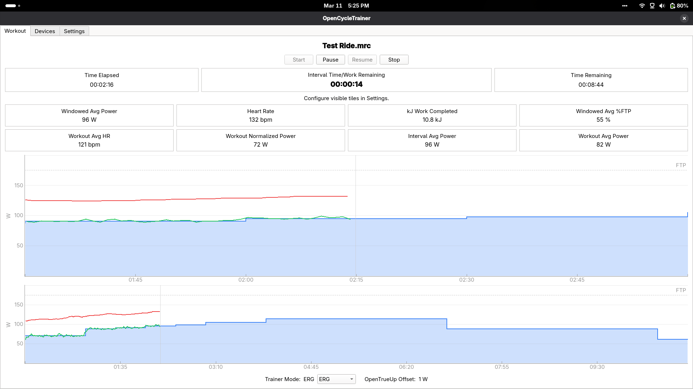

# OpenCycleTrainer

OpenCycleTrainer is a cross-platform open-source workout player for indoor bike training for desktop devices based on Python and PySide6.

## Features
* Graphical and numeric workout interface
* Configurable data fields
* Import of .mrc files for custom workouts
* FIT file export
* ERG and Resistance mode control of Bluetooth FTMS trainers
* Power matching between trainer and on-bike power meter (OpenTrueUp)
* Hybrid control mode which uses ERG for recovery intervals and returns to the last-used Resistance level for work intervals (helpful for VO2max intervals)
* Jog current power target or resistance in 1 or 5% steps via hotkeys
* Extend or skip current interval via hotkeys
* Send calibration command to bike-based power meters
* Lightweight application, fast loading of workouts, no account, subscription, or internet access required!
* No telemetry or privacy invasions required!

## Future possibilities
* Import additional filetypes
* More configurability of data fields and app behavior
* Calculation and display of DFAalpha1 during workout
* Export custom data from workout, such as trainer/PM offset, left/right balance, DFAalpha1, etc.

